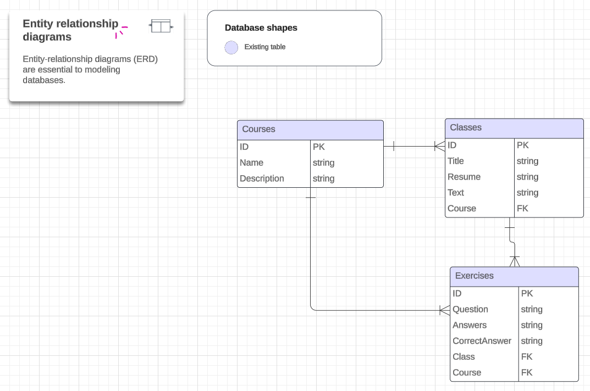

<h1 align="center">
  Evy´s Learning
</h1>
<h2 align="center">
	Course Platform
</h2>
</br>

## 💻 Project Description

This project consists of a platform called Evy's Learning with the aim of offering distance learning courses with activities for students who want to learn english and programming in Brazil. An Entity-Relationship diagram was drawn to illustrate this solution:



---

## ⚙️ Features

- [x] Create, edit, delete and update a course
- [x] Create, edit, delete and update a class
- [x] Create, edit, delete and update an activity
- [x] Create, edit, delete and update an activity
- [x] Unit and integration tests with native Go packages
---

## 🚀 Project Execution

### Pre-requisites
Before you begin, you will need to have the following tools installed on your machine:
[Git](https://git-scm.com), [Go](https://go.dev/).
In addition, it is good to have an editor to work with the code, such as [VSCode](https://code.visualstudio.com/). We will adopt containerization with [Docker](https://www.docker.com/) and relational persistence with the [PostgreSQL](https://www.postgresql.org/) database.

#### 🧭 Running the application

```bash

# Clone this repository
$ git clone git@github.com:EvyOliveira/evysLearning.git

# Access the project folder via the following terminal
$ cd evys-learning

# Initialize module in Go
$ git mod init git@github.com:EvyOliveira/evysLearning.git

# To synchronize code dependencies
$ go mod tidy

```

---

## 🛠 Technologies

The following tools were used during the development of the project:

#### **Website**  
([Go](https://go.dev/) + HTML5 + [Docker](https://www.docker.com/) + [PostgreSQL](https://www.postgresql.org/))
<br>

---

## 🦸 Author

[](https://www.linkedin.com/in/evelyncristinioliveira/)